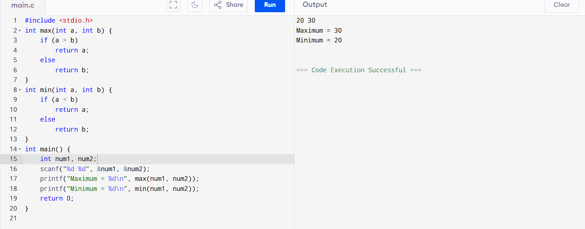
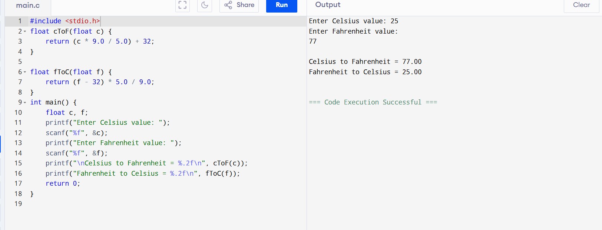
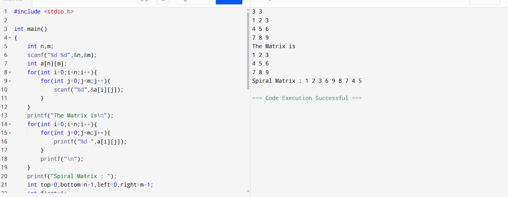

# 19AI304-Fundamentals-of-C-Programming-2025-Odd-M4
# IAPR-4- Module 4 - FoC
## 7. Implementation of Functions.
## 8. Implementation of passing parameters.
# Ex.No:16
  Implement a C program to read a date in the format DD/MM/YYYY and determine whether the entered date is valid. The program should check the correctness of the day, month, and year, including leap year calculations for February.
# Date : 
# Aim:
 To implement a C program that validates a user-entered date using a function without parameters and without return value, ensuring the correctness of day, month, year, and leap year conditions.
# Algorithm:
### Step 1:
  Start
### Step 2: 
  Include the standard input-output library: #include<stdio.h>.
### Step 3:
### Call the function `validateDate()`.
### Inside `validateDate()` function:
### Step 4: 
  Declare variables `dd`, `mm`, and `yy`.
### Step 5: 
  Ask the user to enter a date in `DD/MM/YYYY` format.
### Step 6: 
  Read the date values using `scanf`.
### Step 7: 
  Check if the year is between **1900 and 9999**.
 - If the year is invalid, display **"Year is not valid"** and stop further checks.
### Step 8: 
  Check if the month is between **1 and 12**.
- If the month is invalid, display **"Month is not valid"** and stop further checks.
### Step 9: 
  If the month has **31 days**, check if the day is between **1 and 31**.
### Step 10: 
  If the month has **30 days**, check if the day is between **1 and 30**.
### Step 11: 
  If the month is **February**:
  - Check if the day is between **1 and 28**, or if the day is **29**, verify if it's a **leap year**.
### Step 12: 
  If any valid condition is satisfied, display **"Date is valid."**
### Step 13: 
  Otherwise, display **"Date is invalid."**
### Step 14: 
  Stop
# Program:
```
#include <stdio.h>
int isleapyear()
{
    int year;
    scanf("%d",&year);
    return ((year % 4 == 0 && year % 100!=0)||(year%400==0)); 
}
int validateDate()
{
    int day,month,year;
    scanf("%d/%d/%d",&day,&month,&year);
    if(year<1000||year>9999)
    {
        printf("Year is not valid.\n");
        return 0;
    }
    if(month<1||month>12)
    {
        printf("Month is not valid.\n");
        return 0;
    }
    int daysInMonth[]={31,28,31,30,31,30,31,31,30,31,30,31};
    if(isleapyear(year))
    {
        daysInMonth[1]=29;
    }
    if(day<1||day>daysInMonth[month-1])
    {
        printf("Day is invalid.\n");
        return 0;
    }
    printf("Day is valid.\n");
    return 0;
}


int main(){
    // int day,month,year;
    // scanf("%d%d%d",&day,&month,&year);
    validateDate();
    return 0;
}
```
# Output:
.png>)
# Result: 
Thus, the program was implemented and executed successfully, and the required output was obtained.


# 19AI304-Fundamentals-of-C-Programming-2025-Odd-M4
# IAPR-4- Module 4 - FoC
# Ex.No:17
  Develop a C program to read two numbers from the user and determine the maximum and minimum values. Use user-defined functions with arguments and return values—one function to find the maximum (max()) and another to find the minimum (min()).
# Date : 
# Aim:
 To develop a C program that uses functions with parameters and return values to compute and display the maximum and minimum of two user-entered numbers.
# Algorithm:
### Step 1:
  Start
### Step 2: 
  Include the standard input-output library: #include<stdio.h>.
### Step 3: 
  Declare variables `num1`, `num2`, `maximum`, and `minimum`.
### Step 4: 
  Ask the user to enter two numbers.
### Step 5: 
  Read the numbers using `scanf`.
### Step 6: 
  Call the function `max(num1, num2)`.
### Step 7: 
  Inside function `max(num1, num2)`:
- **Step 7.1:** Receive two integer arguments.  
- **Step 7.2:** Compare the two numbers.  
- **Step 7.3:** If `num1 > num2`, return `num1`.  
- **Step 7.4:** Otherwise, return `num2`.
### Step 8: 
  Store the returned value in `maximum`.
### Step 9: 
  Call the function `min(num1, num2)`.
### Step 10: 
  Inside function `min(num1, num2)`:
- **Step 10.1:** Receive two integer arguments.  
- **Step 10.2:** Compare the two numbers.  
- **Step 10.3:** If `num1 > num2`, return `num2`.  
- **Step 10.4:** Otherwise, return `num1`.
### Step 11: 
  Store the returned value in `minimum`.
### Step 12: 
  Display the returned maximum and minimum values.
### Step 13: 
  Stop
# Program:
```
#include <stdio.h>
int max(int a, int b) {
    if (a > b)
        return a;
    else
        return b;
}
int min(int a, int b) {
    if (a < b)
        return a;
    else
        return b;
}
int main() {
    int num1, num2;
    scanf("%d %d", &num1, &num2);
    printf("Maximum = %d\n", max(num1, num2));
    printf("Minimum = %d\n", min(num1, num2));
    return 0;
}
```
# Output:

# Result: 
Thus, the program was implemented and executed successfully, and the required output was obtained.


# 19AI304-Fundamentals-of-C-Programming-2025-Odd-M4
# IAPR-4- Module 4 - FoC
# Ex.No:18
  Develop a C program to convert temperatures between Celsius and Fahrenheit: Convert Celsius to Fahrenheit using a function that returns the converted value. Convert Fahrenheit to Celsius using another function that returns the converted value. Display the results in the main() function.
# Date : 
# Aim:
 To develop a C program that converts temperatures between Celsius and Fahrenheit using functions with return values.
# Algorithm:
### Step 1:
  Start
### Step 2: 
  Include the standard input-output library: #include<stdio.h>.  
### Step 3:
 Declare function prototypes:
 - `float celtof();`  
 - `float ftocel();`
### Step 4: 
  Enter the `main()` function.
### Step 5:
  Call the `celtof()` function to convert Celsius to Fahrenheit.
### Step 6: 
  Inside `celtof()` function:
 - Declare float variables `C` and `F`.  
 - Display the message: **"Enter the temperature in Celsius"**.  
 - Read the value of `C` from the user.  
 - Calculate Fahrenheit using the formula: `F = (C * 9 / 5) + 32`.  
 - Return `F` to `main()`.
### Step 7: 
  Print the returned Fahrenheit value in `main()`.
### Step 8: 
  Call the `ftocel()` function to convert Fahrenheit to Celsius.
### Step 9: 
  Inside `ftocel()` function:
 - Declare float variables `f` and `celsius`.  
 - Display the message: **"Enter the temperature in Fahrenheit"**.  
 - Read the value of `f` from the user.  
 - Calculate Celsius using the formula: `celsius = (f - 32) * 5 / 9`.  
 - Return `celsius` to `main()`.
### Step 10: 
 Print the returned Celsius value in `main()`.
### Step 11: 
 Stop
# Program:
```
#include <stdio.h>
float cToF(float c) {
    return (c * 9.0 / 5.0) + 32;
}

float fToC(float f) {
    return (f - 32) * 5.0 / 9.0;
}
int main() {
    float c, f;
    printf("Enter Celsius value: ");
    scanf("%f", &c);
    printf("Enter Fahrenheit value: ");
    scanf("%f", &f);
    printf("\nCelsius to Fahrenheit = %.2f\n", cToF(c));
    printf("Fahrenheit to Celsius = %.2f\n", fToC(f));
    return 0;
}
```
# Output:

# Result: 
Thus, the program was implemented and executed successfully, and the required output was obtained.

 
# 19AI304-Fundamentals-of-C-Programming-2025-Odd-M4
# IAPR-4- Module 4 - FoC
# Ex.No:19
  Build a C program to print the elements of a given 4×4 matrix in spiral order starting from the top-left element and moving clockwise,using a user-defined parameterized function without return spiralPrint().
# Date : 
# Aim:
 To build a C program to display the elements of a 2D array in spiral form, traversing the outer elements first and then moving inward in a clockwise direction, using a user-defined parameterized function without return spiralPrint().
# Algorithm:
### Step 1:
  Start
### Step 2: 
  Include the standard input-output library: #include<stdio.h>.  
### Step 3: 
  Define constants `R` and `C` for the number of rows and columns in the matrix.
### Step 4: 
  Declare a function `spiralPrint(int m, int n, int a[R][C])` to print the matrix in spiral order.
### Step 5: 
  Inside `spiralPrint()` function:
 - Initialize variables:  
   - `k = 0` → starting row index  
   - `l = 0` → starting column index  
   - `m` → ending row index  
   - `n` → ending column index  
 - Repeat the following while `k < m` and `l < n`:
   - a. **Print the top row from left to right**:  
     - Loop from column `l` to `n-1` and print `a[k][i]`.  
     - Increment `k`.       
   - b. **Print the last column from top to bottom**:  
     - Loop from row `k` to `m-1` and print `a[i][n-1]`.  
     - Decrement `n`.       
   - c. **If `k < m`, print the bottom row from right to left**:  
     - Loop from column `n-1` to `l` and print `a[m-1][i]`.  
     - Decrement `m`.       
   - d. **If `l < n`, print the first column from bottom to top**:  
     - Loop from row `m-1` to `k` and print `a[i][l]`.  
     - Increment `l`.
### Step 6: 
  In the `main()` function:
- Declare and initialize a 4×4 matrix `a`.  
- Call `spiralPrint(R, C, a)` to print the elements in spiral order.
### Step 7: 
  Stop
# Program:
```
#include <stdio.h>

int main()
{
    int n,m;
    scanf("%d %d",&n,&m);
    int a[n][m];
    for(int i=0;i<n;i++){
        for(int j=0;j<m;j++){
            scanf("%d",&a[i][j]);
        }
    }
    printf("The Matrix is\n");
    for(int i=0;i<n;i++){
        for(int j=0;j<m;j++){
            printf("%d ",a[i][j]);
        }
        printf("\n");
    }
    printf("Spiral Matrix : ");
    int top=0,bottom=n-1,left=0,right=m-1;
    int first=1;
    while(top<=bottom && left<=right){
        for(int i=left;i<=right;i++){
            if(!first);
            printf("%d ",a[top][i]);
            first=0;
        }
        top++;
        for(int i=top;i<=bottom;i++){
            printf("%d ",a[i][right]);
        }
        right--;
        if(top<=bottom){
            for(int i=right;i>=left;i--){
                printf("%d ",a[bottom][i]);
            }
            bottom--;
        }
        if(left<=right){
            for(int i=bottom;i>=top;i--){
                printf("%d ",a[i][left]);
            }
            left++;
        }
    }
    return 0;
}
```
# Output:

# Result: 
Thus, the program was implemented and executed successfully, and the required output was obtained.


# 19AI304-Fundamentals-of-C-Programming-2025-Odd-M4
# IAPR-4- Module 4 - FoC
# Ex.No:20
  Build a C program to convert a string such that the first and last characters, as well as the characters before and after each space, are converted to uppercase. Implement this using a user-defined parameterized function without return.
# Date : 
# Aim:
To build a C program to convert a string as described above, using a user-defined parameterized function without return convertFirstCLastC(char str[]).
# Algorithm:
### Step 1:
  Start
### Step 2: 
  Include the standard input-output library: #include<stdio.h>.  
### Step 3: 
  Declare a user-defined void function `convertFirstCLastC(char str[])` that takes the string as a parameter.
### Step 4: 
 Inside `convertFirstCLastC(char str[])` function:
 - Find the length of the string `len`.  
 - Convert the first character `str[0]` to uppercase.  
 - Loop through the string from index `1` to `len-2`:  
   - If a character is a space, capitalize the character before and after it.  
 - Convert the last character `str[len-1]` to uppercase.
### Step 5: 
 In `main()` function:
 - Declare a string `str[100]`.  
 - Read the input string from the user.  
 - Call the function `convertFirstCLastC(char str[])`.  
 - Print the modified string.
### Step 6: 
 Stop
# Program:
```
#include <stdio.h>
#include <string.h>
#include <ctype.h>
void convertSpecial(char str[])   // parameterized, no return
{
    int i, len;
    len = strlen(str);
    // Remove trailing newline if present
    if(len > 0 && str[len-1] == '\n')
    {
        str[len-1] = '\0';
        len--;
    }
    if(len == 0)
        return;
    str[0] = toupper(str[0]);
    str[len-1] = toupper(str[len-1]);
    for(i = 0; i < len; i++)
    {
        if(str[i] == ' ')
        {
            if(i > 0)
                str[i-1] = toupper(str[i-1]);

            if(i + 1 < len)
             str[i+1] = toupper(str[i+1]);
        }
    }
}
int main()
{
    char str[100];
    printf("Enter a string: ");
    fgets(str, sizeof(str), stdin);
    convertSpecial(str);   // function call
    printf("Converted string: %s\n", str);
    return 0;
}
```
# Output:

# Result: 
Thus, the program was implemented and executed successfully, and the required output was obtained.

